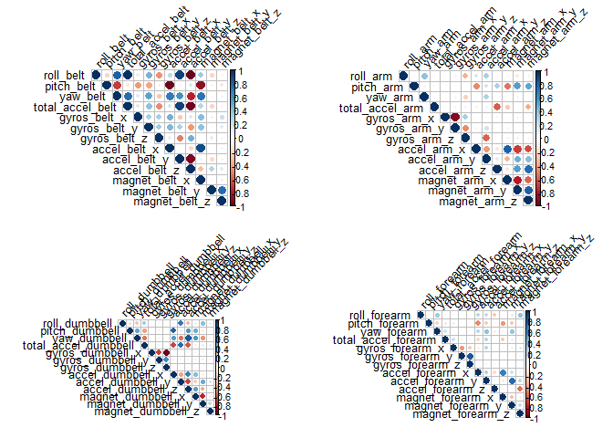
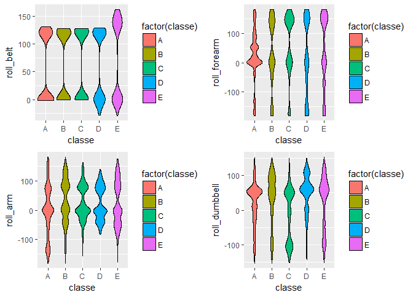
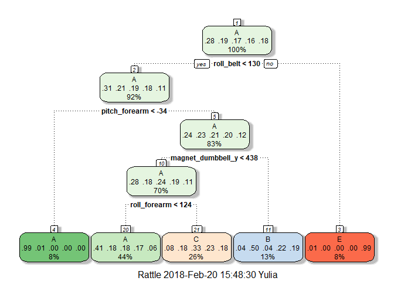

Task Description
----------------

Using devices such as Jawbone Up, Nike FuelBand, and Fitbit it is now
possible to collect a large amount of data about personal activity
relatively inexpensively. These type of devices are part of the
quantified self movement - a group of enthusiasts who take measurements
about themselves regularly to improve their health, to find patterns in
their behavior. One thing that people regularly do is quantify how much
of a particular activity they do, but they rarely quantify how well they
do it. Participants were asked to perform barbell lifts correctly and
incorrectly in 5 different ways. The goal of this project is to use data
from accelerometers on the belt, forearm, arm, and dumbell of 6
participants and ***predict the manner in which they did the exercise***
(the "classe" variable).

More information is available from the website
[here](http://web.archive.org/web/20161224072740/http:/groupware.les.inf.puc-rio.br/har).

Exploring the Data
------------------

Let's download the data from the given source, and check its size.

    library(data.table)
    download.file("http://d396qusza40orc.cloudfront.net/predmachlearn/pml-training.csv",
                  destfile ="pml-training.csv")
    download.file("http://d396qusza40orc.cloudfront.net/predmachlearn/pml-testing.csv",
                  destfile ="pml-testing.csv")
    training_data <- read.csv("pml-training.csv")
    testing_data<-read.csv("pml-testing.csv")
    dim(training_data)

    ## [1] 19622   160

    dim(testing_data)

    ## [1]  20 160

So the *training data* is a huge dataset with almost 20,000 lines,
whereas the *test data* has only 20 lines.

Let's look the data. Given that we have 53 columns the *str* command
will generate a long list, but it is very usefull to have a good look at
it. Additionally let's look at the class of the outcome variable
*classe*.

    str(training_data)

    ## 'data.frame':    19622 obs. of  160 variables:
    ##  $ X                       : int  1 2 3 4 5 6 7 8 9 10 ...
    ##  $ user_name               : Factor w/ 6 levels "adelmo","carlitos",..: 2 2 2 2 2 2 2 2 2 2 ...
    ##  $ raw_timestamp_part_1    : int  1323084231 1323084231 1323084231 1323084232 1323084232 1323084232 1323084232 1323084232 1323084232 1323084232 ...
    ##  $ raw_timestamp_part_2    : int  788290 808298 820366 120339 196328 304277 368296 440390 484323 484434 ...
    ##  $ cvtd_timestamp          : Factor w/ 20 levels "02/12/2011 13:32",..: 9 9 9 9 9 9 9 9 9 9 ...
    ##  $ new_window              : Factor w/ 2 levels "no","yes": 1 1 1 1 1 1 1 1 1 1 ...
    ##  $ num_window              : int  11 11 11 12 12 12 12 12 12 12 ...
    ##  $ roll_belt               : num  1.41 1.41 1.42 1.48 1.48 1.45 1.42 1.42 1.43 1.45 ...
    ##  $ pitch_belt              : num  8.07 8.07 8.07 8.05 8.07 8.06 8.09 8.13 8.16 8.17 ...
    ##  $ yaw_belt                : num  -94.4 -94.4 -94.4 -94.4 -94.4 -94.4 -94.4 -94.4 -94.4 -94.4 ...
    ##  $ total_accel_belt        : int  3 3 3 3 3 3 3 3 3 3 ...
    ##  $ kurtosis_roll_belt      : Factor w/ 397 levels "","-0.016850",..: 1 1 1 1 1 1 1 1 1 1 ...
    ##  $ kurtosis_picth_belt     : Factor w/ 317 levels "","-0.021887",..: 1 1 1 1 1 1 1 1 1 1 ...
    ##  $ kurtosis_yaw_belt       : Factor w/ 2 levels "","#DIV/0!": 1 1 1 1 1 1 1 1 1 1 ...
    ##  $ skewness_roll_belt      : Factor w/ 395 levels "","-0.003095",..: 1 1 1 1 1 1 1 1 1 1 ...
    ##  $ skewness_roll_belt.1    : Factor w/ 338 levels "","-0.005928",..: 1 1 1 1 1 1 1 1 1 1 ...
    ##  $ skewness_yaw_belt       : Factor w/ 2 levels "","#DIV/0!": 1 1 1 1 1 1 1 1 1 1 ...
    ##  $ max_roll_belt           : num  NA NA NA NA NA NA NA NA NA NA ...
    ##  $ max_picth_belt          : int  NA NA NA NA NA NA NA NA NA NA ...
    ##  $ max_yaw_belt            : Factor w/ 68 levels "","-0.1","-0.2",..: 1 1 1 1 1 1 1 1 1 1 ...
    ##  $ min_roll_belt           : num  NA NA NA NA NA NA NA NA NA NA ...
    ##  $ min_pitch_belt          : int  NA NA NA NA NA NA NA NA NA NA ...
    ##  $ min_yaw_belt            : Factor w/ 68 levels "","-0.1","-0.2",..: 1 1 1 1 1 1 1 1 1 1 ...
    ##  $ amplitude_roll_belt     : num  NA NA NA NA NA NA NA NA NA NA ...
    ##  $ amplitude_pitch_belt    : int  NA NA NA NA NA NA NA NA NA NA ...
    ##  $ amplitude_yaw_belt      : Factor w/ 4 levels "","#DIV/0!","0.00",..: 1 1 1 1 1 1 1 1 1 1 ...
    ##  $ var_total_accel_belt    : num  NA NA NA NA NA NA NA NA NA NA ...
    ##  $ avg_roll_belt           : num  NA NA NA NA NA NA NA NA NA NA ...
    ##  $ stddev_roll_belt        : num  NA NA NA NA NA NA NA NA NA NA ...
    ##  $ var_roll_belt           : num  NA NA NA NA NA NA NA NA NA NA ...
    ##  $ avg_pitch_belt          : num  NA NA NA NA NA NA NA NA NA NA ...
    ##  $ stddev_pitch_belt       : num  NA NA NA NA NA NA NA NA NA NA ...
    ##  $ var_pitch_belt          : num  NA NA NA NA NA NA NA NA NA NA ...
    ##  $ avg_yaw_belt            : num  NA NA NA NA NA NA NA NA NA NA ...
    ##  $ stddev_yaw_belt         : num  NA NA NA NA NA NA NA NA NA NA ...
    ##  $ var_yaw_belt            : num  NA NA NA NA NA NA NA NA NA NA ...
    ##  $ gyros_belt_x            : num  0 0.02 0 0.02 0.02 0.02 0.02 0.02 0.02 0.03 ...
    ##  $ gyros_belt_y            : num  0 0 0 0 0.02 0 0 0 0 0 ...
    ##  $ gyros_belt_z            : num  -0.02 -0.02 -0.02 -0.03 -0.02 -0.02 -0.02 -0.02 -0.02 0 ...
    ##  $ accel_belt_x            : int  -21 -22 -20 -22 -21 -21 -22 -22 -20 -21 ...
    ##  $ accel_belt_y            : int  4 4 5 3 2 4 3 4 2 4 ...
    ##  $ accel_belt_z            : int  22 22 23 21 24 21 21 21 24 22 ...
    ##  $ magnet_belt_x           : int  -3 -7 -2 -6 -6 0 -4 -2 1 -3 ...
    ##  $ magnet_belt_y           : int  599 608 600 604 600 603 599 603 602 609 ...
    ##  $ magnet_belt_z           : int  -313 -311 -305 -310 -302 -312 -311 -313 -312 -308 ...
    ##  $ roll_arm                : num  -128 -128 -128 -128 -128 -128 -128 -128 -128 -128 ...
    ##  $ pitch_arm               : num  22.5 22.5 22.5 22.1 22.1 22 21.9 21.8 21.7 21.6 ...
    ##  $ yaw_arm                 : num  -161 -161 -161 -161 -161 -161 -161 -161 -161 -161 ...
    ##  $ total_accel_arm         : int  34 34 34 34 34 34 34 34 34 34 ...
    ##  $ var_accel_arm           : num  NA NA NA NA NA NA NA NA NA NA ...
    ##  $ avg_roll_arm            : num  NA NA NA NA NA NA NA NA NA NA ...
    ##  $ stddev_roll_arm         : num  NA NA NA NA NA NA NA NA NA NA ...
    ##  $ var_roll_arm            : num  NA NA NA NA NA NA NA NA NA NA ...
    ##  $ avg_pitch_arm           : num  NA NA NA NA NA NA NA NA NA NA ...
    ##  $ stddev_pitch_arm        : num  NA NA NA NA NA NA NA NA NA NA ...
    ##  $ var_pitch_arm           : num  NA NA NA NA NA NA NA NA NA NA ...
    ##  $ avg_yaw_arm             : num  NA NA NA NA NA NA NA NA NA NA ...
    ##  $ stddev_yaw_arm          : num  NA NA NA NA NA NA NA NA NA NA ...
    ##  $ var_yaw_arm             : num  NA NA NA NA NA NA NA NA NA NA ...
    ##  $ gyros_arm_x             : num  0 0.02 0.02 0.02 0 0.02 0 0.02 0.02 0.02 ...
    ##  $ gyros_arm_y             : num  0 -0.02 -0.02 -0.03 -0.03 -0.03 -0.03 -0.02 -0.03 -0.03 ...
    ##  $ gyros_arm_z             : num  -0.02 -0.02 -0.02 0.02 0 0 0 0 -0.02 -0.02 ...
    ##  $ accel_arm_x             : int  -288 -290 -289 -289 -289 -289 -289 -289 -288 -288 ...
    ##  $ accel_arm_y             : int  109 110 110 111 111 111 111 111 109 110 ...
    ##  $ accel_arm_z             : int  -123 -125 -126 -123 -123 -122 -125 -124 -122 -124 ...
    ##  $ magnet_arm_x            : int  -368 -369 -368 -372 -374 -369 -373 -372 -369 -376 ...
    ##  $ magnet_arm_y            : int  337 337 344 344 337 342 336 338 341 334 ...
    ##  $ magnet_arm_z            : int  516 513 513 512 506 513 509 510 518 516 ...
    ##  $ kurtosis_roll_arm       : Factor w/ 330 levels "","-0.02438",..: 1 1 1 1 1 1 1 1 1 1 ...
    ##  $ kurtosis_picth_arm      : Factor w/ 328 levels "","-0.00484",..: 1 1 1 1 1 1 1 1 1 1 ...
    ##  $ kurtosis_yaw_arm        : Factor w/ 395 levels "","-0.01548",..: 1 1 1 1 1 1 1 1 1 1 ...
    ##  $ skewness_roll_arm       : Factor w/ 331 levels "","-0.00051",..: 1 1 1 1 1 1 1 1 1 1 ...
    ##  $ skewness_pitch_arm      : Factor w/ 328 levels "","-0.00184",..: 1 1 1 1 1 1 1 1 1 1 ...
    ##  $ skewness_yaw_arm        : Factor w/ 395 levels "","-0.00311",..: 1 1 1 1 1 1 1 1 1 1 ...
    ##  $ max_roll_arm            : num  NA NA NA NA NA NA NA NA NA NA ...
    ##  $ max_picth_arm           : num  NA NA NA NA NA NA NA NA NA NA ...
    ##  $ max_yaw_arm             : int  NA NA NA NA NA NA NA NA NA NA ...
    ##  $ min_roll_arm            : num  NA NA NA NA NA NA NA NA NA NA ...
    ##  $ min_pitch_arm           : num  NA NA NA NA NA NA NA NA NA NA ...
    ##  $ min_yaw_arm             : int  NA NA NA NA NA NA NA NA NA NA ...
    ##  $ amplitude_roll_arm      : num  NA NA NA NA NA NA NA NA NA NA ...
    ##  $ amplitude_pitch_arm     : num  NA NA NA NA NA NA NA NA NA NA ...
    ##  $ amplitude_yaw_arm       : int  NA NA NA NA NA NA NA NA NA NA ...
    ##  $ roll_dumbbell           : num  13.1 13.1 12.9 13.4 13.4 ...
    ##  $ pitch_dumbbell          : num  -70.5 -70.6 -70.3 -70.4 -70.4 ...
    ##  $ yaw_dumbbell            : num  -84.9 -84.7 -85.1 -84.9 -84.9 ...
    ##  $ kurtosis_roll_dumbbell  : Factor w/ 398 levels "","-0.0035","-0.0073",..: 1 1 1 1 1 1 1 1 1 1 ...
    ##  $ kurtosis_picth_dumbbell : Factor w/ 401 levels "","-0.0163","-0.0233",..: 1 1 1 1 1 1 1 1 1 1 ...
    ##  $ kurtosis_yaw_dumbbell   : Factor w/ 2 levels "","#DIV/0!": 1 1 1 1 1 1 1 1 1 1 ...
    ##  $ skewness_roll_dumbbell  : Factor w/ 401 levels "","-0.0082","-0.0096",..: 1 1 1 1 1 1 1 1 1 1 ...
    ##  $ skewness_pitch_dumbbell : Factor w/ 402 levels "","-0.0053","-0.0084",..: 1 1 1 1 1 1 1 1 1 1 ...
    ##  $ skewness_yaw_dumbbell   : Factor w/ 2 levels "","#DIV/0!": 1 1 1 1 1 1 1 1 1 1 ...
    ##  $ max_roll_dumbbell       : num  NA NA NA NA NA NA NA NA NA NA ...
    ##  $ max_picth_dumbbell      : num  NA NA NA NA NA NA NA NA NA NA ...
    ##  $ max_yaw_dumbbell        : Factor w/ 73 levels "","-0.1","-0.2",..: 1 1 1 1 1 1 1 1 1 1 ...
    ##  $ min_roll_dumbbell       : num  NA NA NA NA NA NA NA NA NA NA ...
    ##  $ min_pitch_dumbbell      : num  NA NA NA NA NA NA NA NA NA NA ...
    ##  $ min_yaw_dumbbell        : Factor w/ 73 levels "","-0.1","-0.2",..: 1 1 1 1 1 1 1 1 1 1 ...
    ##  $ amplitude_roll_dumbbell : num  NA NA NA NA NA NA NA NA NA NA ...
    ##   [list output truncated]

    class(training_data$classe)

    ## [1] "factor"

    levels(training_data$classe)

    ## [1] "A" "B" "C" "D" "E"

So we see, mostly the data are numeric and integers, there seem to be
many Na values, No's, etc. I.e. **data need cleaning**.

As for the *classe* variable this is a factor with 5 outcomes: *A, B, C,
D, E*.

Let's do the cleaning in four steps:

-   remove all columns that have more than 80% of the values = Na

-   remove all columns that have more than 80% of the values empty

-   remove all columns that have more than 80% of the values = "no"

-   remove the first six columns, as they only providin the description
    of the case, thus don't need to be the part of the algorithm.

<!-- -->

    columns_check_NA <- apply(apply(training_data, 2, is.na),2,mean)
    NA_columns<-columns_check_NA>0.8
    training_data[NA_columns]<-NULL
    testing_data[NA_columns]<-NULL

    columns_check_EMPTY <- apply(training_data=="",2,mean)
    EMPTY_columns<-columns_check_EMPTY>0.8
    training_data[EMPTY_columns]<-NULL
    testing_data[EMPTY_columns]<-NULL

    columns_check_NO <- apply(training_data=="no",2,mean)
    NO_columns<-columns_check_NO>0.8
    training_data[NO_columns]<-NULL
    testing_data[NO_columns]<-NULL

    training_data[,1:6]<-NULL
    testing_data[,1:6]<-NULL

Lastly let's look at the near-zero-columns in the remaining dataset and
at the possible ammount of the Na cells.

    suppressMessages(library(caret))
    nearZeroVar_training <- nearZeroVar(training_data, saveMetrics=TRUE)
    sum(nearZeroVar_training$nzv)

    ## [1] 0

    max(is.na(training_data))

    ## [1] 0

And it can be seen, that there are no near-zero-columns and absolutely
no Na values left. So the dataset is now tidy

But it is still worth to make the last check, i.e. to browse through the
columns' names to select only those that contain the four key-words for
the exercise type.

    relevant_column <- grepl("belt|forearm|[^(fore)]arm|dumbbell", names(training_data))
    relevant_column

    ##  [1]  TRUE  TRUE  TRUE  TRUE  TRUE  TRUE  TRUE  TRUE  TRUE  TRUE  TRUE
    ## [12]  TRUE  TRUE  TRUE  TRUE  TRUE  TRUE  TRUE  TRUE  TRUE  TRUE  TRUE
    ## [23]  TRUE  TRUE  TRUE  TRUE  TRUE  TRUE  TRUE  TRUE  TRUE  TRUE  TRUE
    ## [34]  TRUE  TRUE  TRUE  TRUE  TRUE  TRUE  TRUE  TRUE  TRUE  TRUE  TRUE
    ## [45]  TRUE  TRUE  TRUE  TRUE  TRUE  TRUE  TRUE  TRUE FALSE

The last column is the *classe* column - the outcome, and the rest of
the 52 columns are all relevant, basically this is the same output for
four sensors: 52=4x13, i.e. we have the tidy data, with only relevant
data (which we could still reduce, and thus possibly introduce bias, but
will not do in this case) and can proceed to the machine learning part.

Visualizing the data
--------------------

To finish up the data-exploring let's make two multi-panel plots.

First let's look for the correlation between the 13 predictors for each
accelerometer. In case we see some strong correlation, we might consider
removing some columns from the predictors list.

Correlation matrix values are low for the arm and forearm sensors, the
dumbbell values are somnewhat higher, but still rather insignificant,
there are a couple of high correlation values in the belt sensor, but
still not knowing more, I would prefer to leave the two-three predictors
(out of 52) in the model.

Let's also look at the points distribution of one of the 13 parammeters
for all four sensors, for instance the *roll* parameter.

We can see some clear separation in the violin plots, this might be good
for the *rpart* method.

Preparing machine learning
--------------------------

First let's divide the *training data* into two subsets - train (75%)
and check (25%) - to make the cross validation.

    set.seed(111)
    subset_train <- createDataPartition(training_data$classe, p=0.75)
    train_train <- training_data[subset_train[[1]],]
    train_check <- training_data[-subset_train[[1]],]

Let's try several algorithms from the lectures, namely *rpart, gbm, nb,
lda, rf*. No data preprocessing is performed here at the moment.

    ML_rpart <- train(classe ~ ., data = train_train, method = "rpart")
    suppressMessages(library(gbm))
    ML_gbm   <- gbm(classe ~ . , data = train_train)

    ## Distribution not specified, assuming multinomial ...

    ML_nb    <- train(classe ~ ., data = train_train, method = "naive_bayes")
    ML_lda   <- train(classe ~ ., data = train_train, method = "lda")
    suppressMessages(library(randomForest))
    ML_rf    <- randomForest(classe ~ . , data = train_train)

For the *rpart* method we can have a quick look at the obtained tree:

    suppressMessages(library(rattle))
    fancyRpartPlot(ML_rpart$finalModel)

Quite a small tree, which uses only 4 of the 52 input variables.

For all these five methods let't look at the out-of-sample error on the
two subsets of the training data.

<table>
<thead>
<tr class="header">
<th></th>
<th align="left">methods_names</th>
<th align="left">Training_OSE</th>
<th align="left">CrossCheck_OSE</th>
</tr>
</thead>
<tbody>
<tr class="odd">
<td>Accuracy</td>
<td align="left">rpart</td>
<td align="left">0.498</td>
<td align="left">0.49</td>
</tr>
<tr class="even">
<td>Accuracy</td>
<td align="left">gbm</td>
<td align="left">0.492</td>
<td align="left">0.488</td>
</tr>
<tr class="odd">
<td>Accuracy</td>
<td align="left">nb</td>
<td align="left">0.759</td>
<td align="left">0.746</td>
</tr>
<tr class="even">
<td>Accuracy</td>
<td align="left">lda</td>
<td align="left">0.707</td>
<td align="left">0.697</td>
</tr>
<tr class="odd">
<td>Accuracy</td>
<td align="left">rf</td>
<td align="left">1</td>
<td align="left">0.997</td>
</tr>
</tbody>
</table>

It can be seen that for all five methods the diffence in the accuracy
for the training subset of the training data and the cross-check subset
is below 1%; both *rpart* and *gbm* are resulting in quite low accuracy
of about 50% only, *lda* and *nb* are somewhat better with approximately
70% ad 75%, and *rf* method is on the top of the list with 99.7%
accuracy on the cross-validation set.

Before we try the algorithms on the pure test data let't quickly check,
whether data preprocessing could make the result even better. Let's do
it for the *rf* method, and for the *lda* that has the highest
difference in the accuracy during the cross-check.

<table>
<thead>
<tr class="header">
<th></th>
<th align="left">methods_names_PrePro</th>
<th align="left">Training_OSE</th>
<th align="left">CrossCheck_OSE</th>
</tr>
</thead>
<tbody>
<tr class="odd">
<td>Accuracy</td>
<td align="left">lda</td>
<td align="left">0.707</td>
<td align="left">0.697</td>
</tr>
<tr class="even">
<td>Accuracy</td>
<td align="left">rf</td>
<td align="left">1</td>
<td align="left">0.997</td>
</tr>
<tr class="odd">
<td>Accuracy</td>
<td align="left">lda_PrePro</td>
<td align="left">0.707</td>
<td align="left">0.697</td>
</tr>
<tr class="even">
<td>Accuracy</td>
<td align="left">rf_PrePro</td>
<td align="left">1</td>
<td align="left">0.995</td>
</tr>
</tbody>
</table>

Not much of a change, but also none was expected. The violin plots
above, together with some similar plots for other prdicotrs now shown
here, have shown little outliers, rather dense point clouds. Thus in
this particular case preprocessing is not extremely beneficial.

Testing the model
-----------------

For the final test only the two best methods will be used: *rf* and
*nb*. And the predictions given by them are shown in the table below.

<table>
<thead>
<tr class="header">
<th align="left">nb.method</th>
<th align="left">rf.method</th>
<th align="left">Comparison</th>
</tr>
</thead>
<tbody>
<tr class="odd">
<td align="left">C</td>
<td align="left">B</td>
<td align="left">FALSE</td>
</tr>
<tr class="even">
<td align="left">A</td>
<td align="left">A</td>
<td align="left">TRUE</td>
</tr>
<tr class="odd">
<td align="left">A</td>
<td align="left">B</td>
<td align="left">FALSE</td>
</tr>
<tr class="even">
<td align="left">A</td>
<td align="left">A</td>
<td align="left">TRUE</td>
</tr>
<tr class="odd">
<td align="left">A</td>
<td align="left">A</td>
<td align="left">TRUE</td>
</tr>
<tr class="even">
<td align="left">E</td>
<td align="left">E</td>
<td align="left">TRUE</td>
</tr>
<tr class="odd">
<td align="left">D</td>
<td align="left">D</td>
<td align="left">TRUE</td>
</tr>
<tr class="even">
<td align="left">C</td>
<td align="left">B</td>
<td align="left">FALSE</td>
</tr>
<tr class="odd">
<td align="left">A</td>
<td align="left">A</td>
<td align="left">TRUE</td>
</tr>
<tr class="even">
<td align="left">A</td>
<td align="left">A</td>
<td align="left">TRUE</td>
</tr>
<tr class="odd">
<td align="left">A</td>
<td align="left">B</td>
<td align="left">FALSE</td>
</tr>
<tr class="even">
<td align="left">A</td>
<td align="left">C</td>
<td align="left">FALSE</td>
</tr>
<tr class="odd">
<td align="left">B</td>
<td align="left">B</td>
<td align="left">TRUE</td>
</tr>
<tr class="even">
<td align="left">A</td>
<td align="left">A</td>
<td align="left">TRUE</td>
</tr>
<tr class="odd">
<td align="left">E</td>
<td align="left">E</td>
<td align="left">TRUE</td>
</tr>
<tr class="even">
<td align="left">B</td>
<td align="left">E</td>
<td align="left">FALSE</td>
</tr>
<tr class="odd">
<td align="left">A</td>
<td align="left">A</td>
<td align="left">TRUE</td>
</tr>
<tr class="even">
<td align="left">B</td>
<td align="left">B</td>
<td align="left">TRUE</td>
</tr>
<tr class="odd">
<td align="left">B</td>
<td align="left">B</td>
<td align="left">TRUE</td>
</tr>
<tr class="even">
<td align="left">B</td>
<td align="left">B</td>
<td align="left">TRUE</td>
</tr>
</tbody>
</table>

The two methods give the same prediction in

    ## [1] 14

out of 20 cases and given the OSE on the cross-validation set the
results from the random forest method are to be used, since they are
expected to predict the results better.

Summary
-------

Out of the five methods that were tested - *rpart, gbm, nb, lda, rf* -
for the data in question the least out-of-sample error is given by the
***random forest***, and it is 99.7% correct on the cross-check data.
The prediction for the test dataset is shown in the table above.

The second best method is ***nb***, it is correct 75% of times during
the cross-validation, and its prediction for the test data differs from
that given by the random forest in 6 out of 20 cases.
